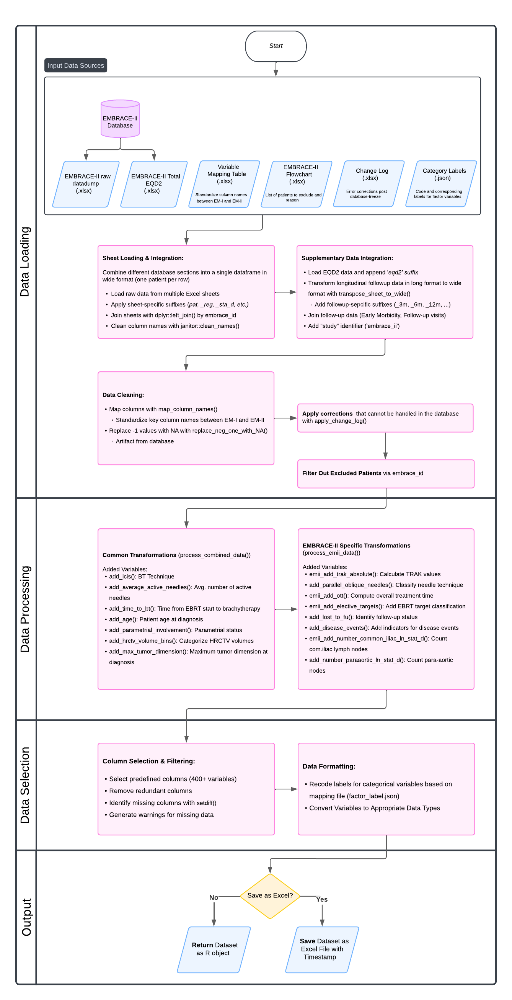

```{r, include = FALSE}
knitr::opts_chunk$set(
  collapse = TRUE,
  comment = "#>"
)
```

## Overview

The `embraceR` package provides a comprehensive data processing pipeline for the EMBRACE-II study data. This article explains the data flow from raw input files to the final clean dataset ready for analysis.

## Data Processing Pipeline




```r
# Example of getting the final clean dataset
clean_data <- emii_get_clean_data()

# With Excel export
clean_data <- emii_get_clean_data(save_excel = TRUE)
```

